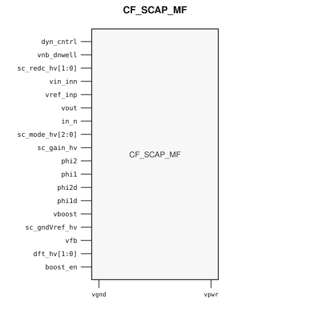

# CF_SCAP_MF

> Switched-Capacitor Filter/Gain

Draft for designer review. The public GDS is an abstract; ChipFoundry
substitutes protected full geometry at tapeout.

This package ships an SRAM-style PG wrap `CF_SCAP_MF` around analog leaf
`CF_SCAP_MF_core`.

## Overview

`CF_SCAP_MF` is a SkyWater 130 nm hard-macro switched-capacitor array for
configurable filter and gain modes. Instantiate `CF_SCAP_MF`.

Macro size is 362.35 × 138.875 µm (15 µm halo around analog leaf
332.35 × 108.875 µm). Customer PG for chip PDN is `vpwr` / `vgnd`. Analog
boost `vboost` stays a wrap port and is routed as a signal. Well tap `vpb`
is tied inside the wrap.

## Installation

```bash
pip install cf-ipm
ipm install CF_SCAP_MF --version 0.2.0 --include-drafts
```

Until the marketplace listing is published, install from a local catalog
override:

```bash
ipm install CF_SCAP_MF --version 0.2.0 --include-drafts --local-file ip/catalog.json
```

Use `hdl/gl/CF_SCAP_MF.v` as the customer blackbox, `layout/lef/CF_SCAP_MF.lef`
for P&R, and `layout/gds/CF_SCAP_MF.gds` / `layout/mag/CF_SCAP_MF.mag` for the
public wrap. `CF_SCAP_MF_core` is the analog leaf (empty Verilog, pin-only
abstract). ChipFoundry substitutes vault GDS into `CF_SCAP_MF_core` at tapeout.
P&R uses the wrap LEF (`vpwr` / `vgnd` for chip PDN).

## Features

- Analog terminals `vin_inn` / `in_n` / `vref_inp` / `vout` / `vfb`
- High-voltage mode `sc_mode_hv[2:0]`, gain `sc_gain_hv`, and reduce `sc_redc_hv[1:0]`
- Non-overlapping clocks `phi1` / `phi2` and delayed clocks `phi1d` / `phi2d`
- Boost analog supply `vboost` and enable `boost_en` (wrap signal ports)
- DFT `dft_hv[1:0]` and analog control `dyn_cntrl`
- Customer cell `CF_SCAP_MF` 362.35 × 138.875 µm (15 µm halo around analog leaf 332.35 × 108.875 µm)
- Chip PDN is `vpwr` / `vgnd`

## Pinout

Customer documentation includes a pinout of the integration cell only.
Internal schematics and architecture block diagrams are not published.



Pin names and directions match the public wrap (`layout/lef/CF_SCAP_MF.lef`)
and the blackbox stub (`hdl/gl/CF_SCAP_MF.v`).

## Pin Description

Directions and widths are taken from the shipped Verilog in `hdl/gl/CF_SCAP_MF.v`.

| Name | Direction | Width | Description |
|---|---|---:|---|
| `dyn_cntrl` | inout | 1 | Dynamic analog control. |
| `vnb_dnwell` | input | 1 | Deep n-well tap. Route as a signal; not on chip PDN. |
| `sc_redc_hv` | input | 2 | High-voltage reduce control. |
| `vin_inn` | inout | 1 | Analog input. |
| `vref_inp` | inout | 1 | Analog reference input. |
| `vout` | inout | 1 | Analog output. |
| `in_n` | inout | 1 | Analog negative input. |
| `sc_mode_hv` | input | 3 | High-voltage operating mode. |
| `sc_gain_hv` | input | 1 | High-voltage gain select. |
| `phi2` | input | 1 | Switched-capacitor clock phase 2. |
| `phi1` | input | 1 | Switched-capacitor clock phase 1. |
| `phi2d` | input | 1 | Delayed clock phase 2. |
| `phi1d` | input | 1 | Delayed clock phase 1. |
| `vboost` | input | 1 | Analog boost supply. Route as a signal; not on chip PDN. |
| `sc_gndVref_hv` | inout | 1 | Analog ground / reference. Route as a signal; not on chip PDN. |
| `vfb` | input | 1 | Analog feedback. |
| `dft_hv` | input | 2 | High-voltage DFT. |
| `boost_en` | input | 1 | Boost enable. |
| `vpwr` | input | 1 | Digital supply. |
| `vgnd` | input | 1 | Ground. |

`CF_SCAP_MF_core` also has well tap `vpb`. The wrap ties `.vpb(vpwr)`. Do
not connect that pin at chip level.

In OpenLane / LibreLane, hook chip PDN with
`PDN_MACRO_CONNECTIONS: "u_cf_scap_mf vccd1 vssd1 vpwr vgnd"` and connect
`.vpwr(vccd1)`, `.vgnd(vssd1)` under `USE_POWER_PINS`. Route analog
terminals and `vboost` onto `analog_io`.

## Limitations and Open Issues

- Verilog in `hdl/gl/CF_SCAP_MF.v` is a structural wrap around an empty
  `CF_SCAP_MF_core` blackbox, not a SPICE-accurate model.
- Liberty is not in this first wrap drop. P&R uses the wrap LEF.
- Companion clock, opamp, and ESD-wrapped tops stay foundry-only. This
  package ships the working switched-capacitor array integration cell.
